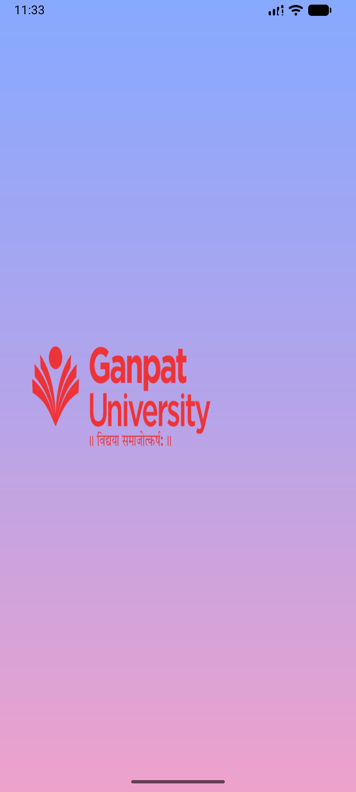
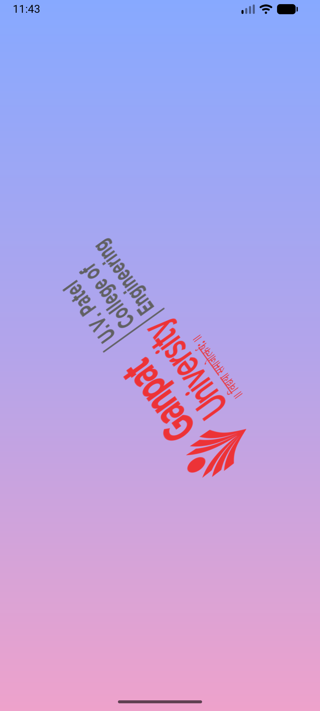
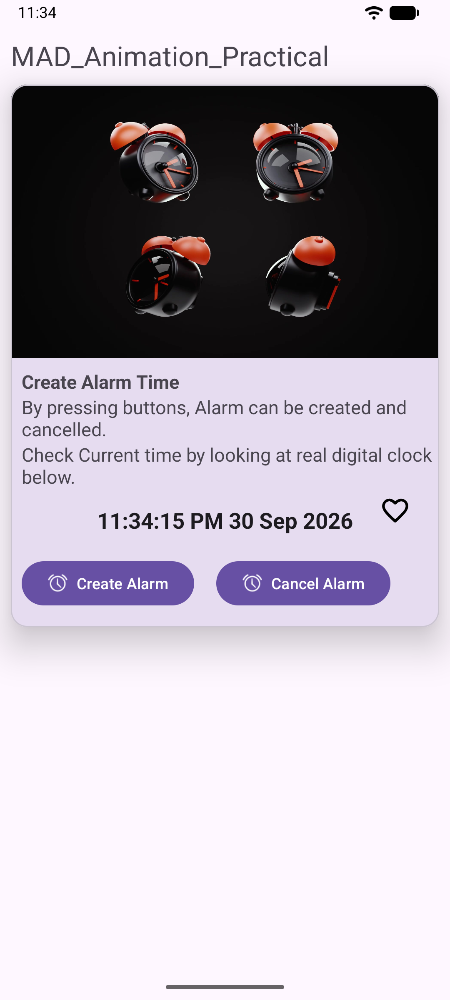
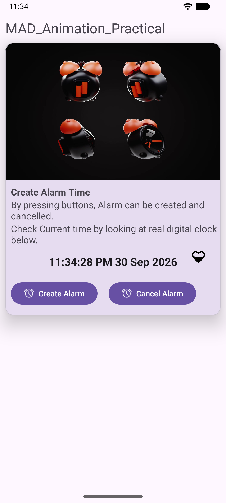

# 📱 MAD Practical 6 — Android Animations

> **Course:** 2CEIT5PE18 — Mobile Application Development (MAD)  
> **Submitted By:** Maharsh Patel  
> **Enrollment Number:** 24012011102

---

## 📌 Objective

Demonstrate the use of **Android Animation APIs** by building an app that incorporates:

- **Frame-by-Frame Animation** (using `AnimationDrawable`)
- **Tween Animation** (using XML-based `<rotate>`)
- **Animated Splash Screen** with transition to the main activity

---

## 🗂️ Project Structure

```
app/src/main/
├── java/.../
│   ├── SplashActivity.kt      ← Animated splash screen (launcher)
│   └── MainActivity.kt        ← Main screen with frame animations
├── res/
│   ├── anim/
│   │   └── twin_animation.xml          ← Tween rotation (360°)
│   ├── drawable/
│   │   ├── alarm1.jpg … alarm10.jpg    ← Alarm clock frames
│   │   ├── alarm_animation_list.xml    ← Frame animation – Alarm
│   │   ├── ic_heart_0.xml … ic_heart_100.xml ← Heart vector frames
│   │   ├── heart_animation_list.xml    ← Frame animation – Heart
│   │   ├── uvpce_logo.png … uvpce_logo_7.png ← UVPCE logo frames
│   │   ├── uvpce_animation_list.xml    ← Frame animation – Logo
│   │   └── rectangle_gradient.xml      ← Splash gradient background
│   └── layout/
│       ├── activity_splash.xml         ← Splash screen layout
│       └── activity_main.xml           ← Main screen layout
```

---

## 🚀 App Flow

```
┌─────────────────────┐
│   SplashActivity    │
│                     │
│  1. UVPCE logo      │
│     builds up       │
│     frame-by-frame  │
│                     │
│  2. Logo rotates    │
│     360° (tween)    │
│                     │
│  3. Fade transition │
│     to MainActivity │
└────────┬────────────┘
         │
         ▼
┌─────────────────────┐
│   MainActivity      │
│                     │
│  • Alarm clock      │
│    frame animation  │
│  • Heart-beat       │
│    frame animation  │
│  • Live TextClock   │
│  • Create / Cancel  │
│    Alarm buttons    │
└─────────────────────┘
```

---

## ✨ Animations Used

### 1. Frame-by-Frame Animation — Splash Logo

| Property | Value |
|---|---|
| **File** | `uvpce_animation_list.xml` |
| **Frames** | 8 (uvpce_logo_1 → uvpce_logo) |
| **Duration** | 250 ms per frame (400 ms for final) |
| **One-shot** | `true` — plays once, then triggers tween |

### 2. Tween Animation — Logo Rotation

| Property | Value |
|---|---|
| **File** | `twin_animation.xml` |
| **Type** | `<rotate>` (0° → 360°) |
| **Duration** | 1200 ms |
| **Pivot** | Center (50%, 50%) |
| **Fill After** | `true` |

### 3. Frame-by-Frame Animation — Alarm Clock

| Property | Value |
|---|---|
| **File** | `alarm_animation_list.xml` |
| **Frames** | 9 (alarm1 → alarm9) |
| **Duration** | 200 ms per frame |
| **Looping** | Continuous |

### 4. Frame-by-Frame Animation — Heart Beat

| Property | Value |
|---|---|
| **File** | `heart_animation_list.xml` |
| **Frames** | 5 vector drawables (0% → 100% fill) |
| **Duration** | 200 ms per frame |
| **Looping** | Continuous |

---

## 🛠️ Tech Stack

| Component | Technology |
|---|---|
| Language | Kotlin |
| Min SDK | 24 (Android 7.0) |
| Target SDK | 37 |
| UI Toolkit | XML Layouts + ConstraintLayout |
| Material Design | Material CardView, Buttons |
| Build System | Gradle (Kotlin DSL) |

---

## ▶️ How to Run

1. **Clone the repository**
   ```bash
   git clone https://github.com/maharsh-patel/MAD_24012011102_Practical_6.git
   ```
2. **Open in Android Studio** (Ladybug or later recommended)
3. **Sync Gradle** — let dependencies download
4. **Run on emulator or device** (API 24+)

---

## 📚 Key Concepts Demonstrated

- **`AnimationDrawable`** — programmatic control of frame-by-frame animations via `start()` / `stop()`
- **`AnimationUtils.loadAnimation()`** — loading XML-defined tween animations at runtime
- **`Animation.AnimationListener`** — reacting to animation lifecycle events (`onAnimationEnd` triggers screen transition)
- **`Handler.postDelayed()`** — scheduling tween animation to start after all frames have played
- **Activity transitions** — `overridePendingTransition()` for smooth fade between activities
- **Edge-to-Edge UI** — `enableEdgeToEdge()` for immersive layout

---

## 📸 Output Screenshots

| Splash Screen | Tween Rotation | Main Activity (Frame 1) | Main Activity (Frame 2) |
|:---:|:---:|:---:|:---:|
|  |  |  |  |

---

## 📄 License

This project is created for academic purposes as part of the MAD course at UVPCE.
